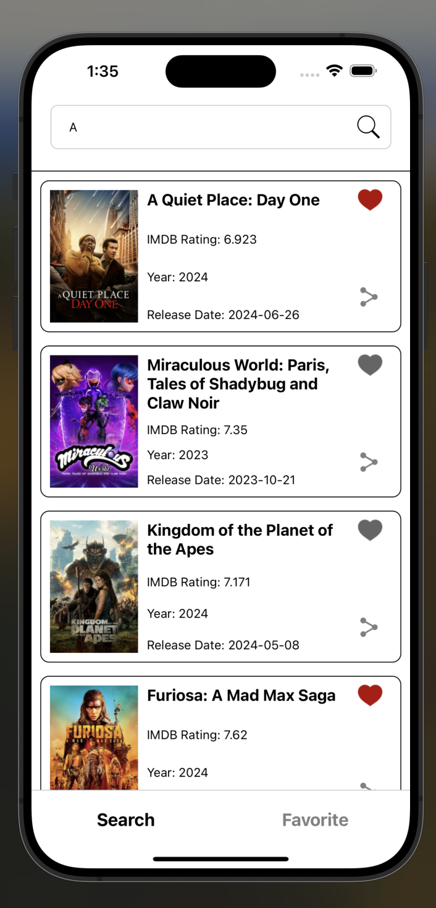
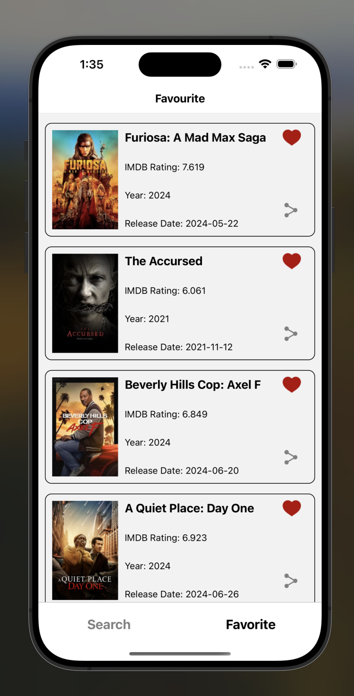
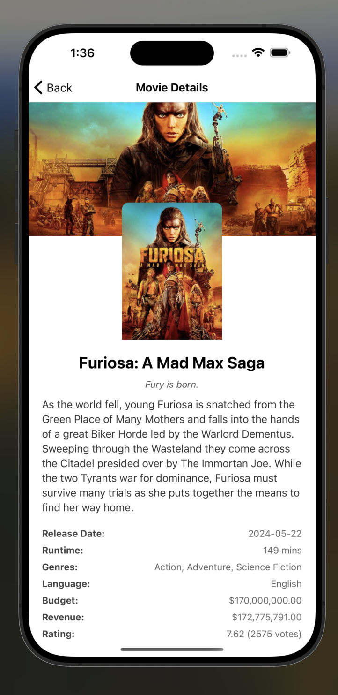

# MovieApp

[](LICENSE) [](https://reactnative.dev)

MovieApp is a React Native application that allows users to search for movies, view movie details, and manage their favorite movies using [TheMovieDB API](https://www.themoviedb.org/documentation/api).

## Table of Contents

- [Features](#features)
- [Prerequisites](#prerequisites)
- [Installation](#installation)
- [Getting Started](#getting-started)
  - [Step 1: Start the Metro Server](#step-1-start-the-metro-server)
  - [Step 2: Start your Application](#step-2-start-your-application)
    - [For Android](#for-android)
    - [For iOS](#for-ios)
- [Packages and Dependencies](#packages-and-dependencies)
  - [Scripts](#scripts)
  - [Dependencies](#dependencies)
  - [Dev Dependencies](#dev-dependencies)
- [Contributing](#contributing)
- [License](#license)
- [Contact](#contact)

## Features

- **Home Page:**
  - Two main options: Search Movies and View User’s Favorite Movies.

- **Search Movies:**
  - Search for movies using TheMovieDB API.
  - Display details including Movie poster, Title, IMDB rating, Year, and Release date.
  - Add movies to favorites.
  - Share movie posters via WhatsApp, email, etc.
  - Support for pagination.


- **Favorite Movies:**
  - View and manage movies marked as favorites.
  - Share movie posters via WhatsApp, email, etc.

- **Movie Details:**
  - Detailed view of movie information passed from the previous screen.
  - Pull to refresh capability.

<p align="center">
  
  
  
</p>

## Prerequisites

Before you begin, ensure you have met the following requirements:

- **Node.js**: Version 18 or higher.
- **npm or Yarn**: Package managers.
- **Android Studio**: For Android development.
- **Xcode**: For iOS development.
- **React Native CLI**: To run React Native commands.

## Installation

Follow these steps to install the project and its dependencies:

1. **Clone the Repository**

   ```bash
   git clone https://github.com/yourusername/MovieApp.git
   cd MovieApp

- using npm:

  npm install 

- OR using Yarn:

   yarn 

2. **Run App**

# Android

- using npm: 

  npm run android

- OR using Yarn: 

  yarn android

# Ios

- using npm:
  
  npm run ios

- OR using Yarn:
  
  yarn ios


